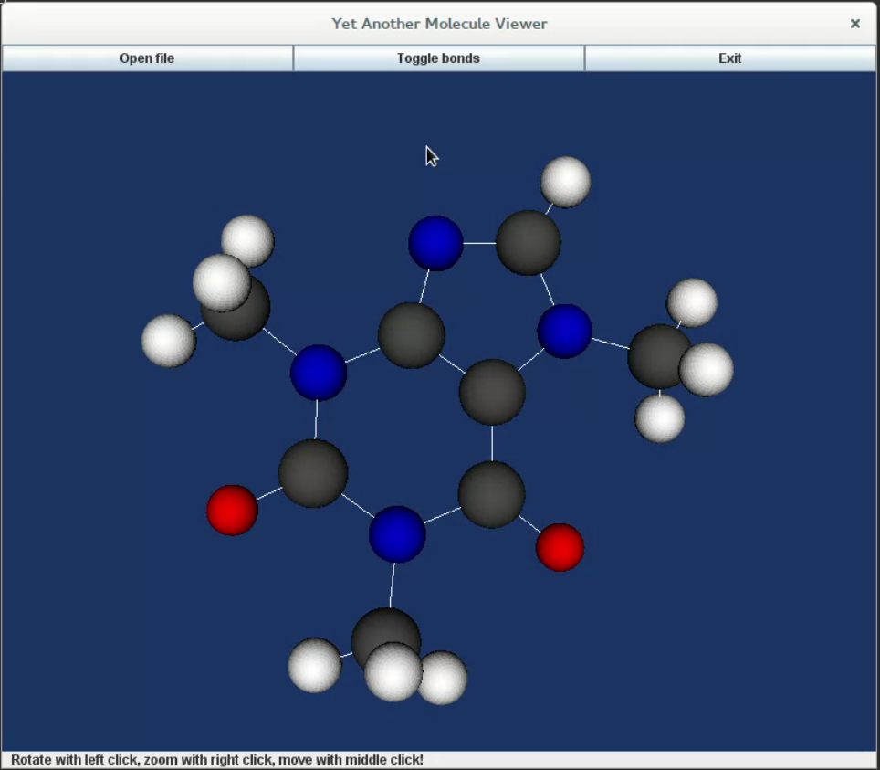
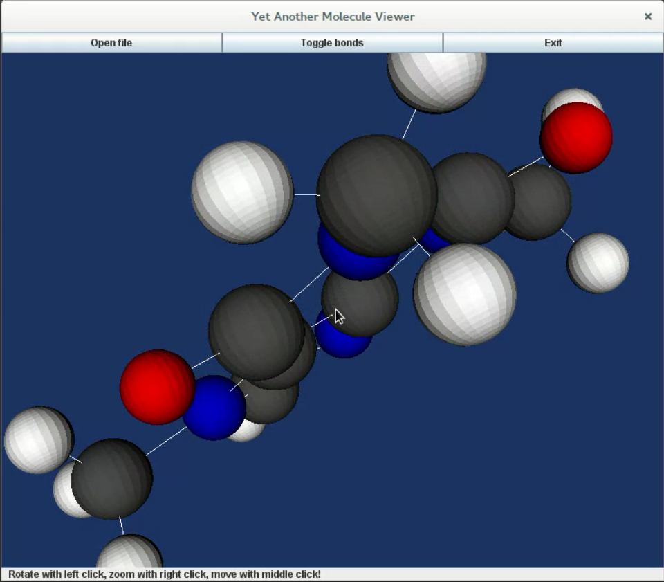

#Yet Another Molecule Viewer
This is a simple molecule viewer made in Java with the use of VTK. It serves as a simple example of a use case for VTK.

Currently it supports only .cml (chemical markup language) files and has a very simple visualization of them. A test file (meth.cml) is provided in the testfile folder

Please check out the VTK wiki on how to build VTK Java projects.

Some screenshots of the app:

Feel free to ask any questions.
[Tomislav Subic](http://tomislavsubi.ch/)
